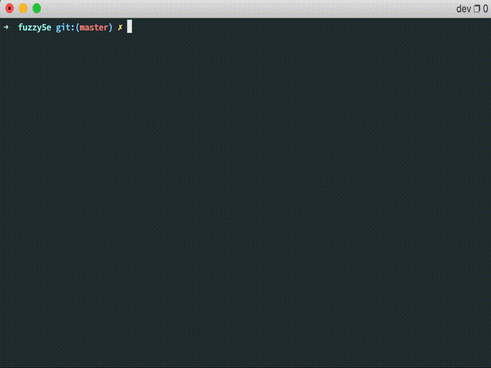

[![Contributors][contributors-shield]][contributors-url]
[![Issues][issues-shield]][issues-url]


<br />
<p align="center">
  <a href="https://github.com/cachance7/fuzzy5e">
    
  </a>

  <h3 align="center">Fuzzy5e</h3>

  <p align="center">
    A D&D 5th edition reference for your terminal.
  </p>
</p>

<p align="center">

</p>


<!-- TABLE OF CONTENTS -->
## Table of Contents

* [About the Project](#about-the-project)
  * [Built With](#built-with)
* [Getting Started](#getting-started)
  * [Prerequisites](#prerequisites)
  * [Installation](#installation)
  * [Usage](#usage)
* [Contributing](#contributing)
* [License](#license)
* [Contact](#contact)
* [Acknowledgements](#acknowledgements)


<!-- ABOUT THE PROJECT -->
## About The Project

As a DM I find myself constantly looking up spells and monster stat blocks while running the game. As a programmer, the terminal is my most concise at-a-glance space for text information. After years of struggling to juggle browser windows and tabs, I decided to build this as a sort of quick reference and HUD for my most commonly referenced information. 

NOTE: This is very much a **_work in progress_**.


_Tiling in tmux turns out to be exactly what I wanted._


### Built With

* [Rust](https://www.rust-lang.org/) - this app is written in rust
* [tuikit](https://github.com/lotabout/tuikit) - leaned on this heavily for the terminal UI presentation
* [5e-database](https://github.com/bagelbits/5e-database) - SRD data is sourced from here
* [Sonic](https://github.com/valeriansaliou/sonic) - used to index the information for quick on-the-fly lookup
* [Docker](https://www.docker.com/) - for running the dependent services and redistributing


<!-- GETTING STARTED -->
## Getting Started

fuzzy5e is a terminal UI written in Rust, but it relies on several external services to function. The easiest way to get up and running is to use Docker and docker-compose.

### Prerequisites

- [Install Docker & docker-compose](https://docs.docker.com/get-docker/)


### Installation

1. Clone the repo
```sh
git clone https://github.com/cachance7/fuzzy5e
```
2. Run the helper script. After pulling and building the containers there is a one-time indexing that will occur.
```sh
cd fuzzy5e && ./fuzzy5e
```
3. Enjoy!


### Usage

- Start the program with `fuzzy5e` helper script
- Type to begin searching
- `Ctrl+N` / `Ctrl+P`: select next / previous match
- `Up` / `Down` / `PgUp` / `PgDown`: scroll the selected content up or down
- `Enter`: show the selected match full window
- `Esc`: quit

<!-- CONTRIBUTING -->
## Contributing

If you'd like to contribute, feel free to open up a PR and let's make it work!


<!-- LICENSE -->
## License

Distributed under the MIT License. See `LICENSE` for more information.


<!-- CONTACT -->
## Contact

[Casey Chance](mailto:casey@chance.email?subject=fuzzy5e)

Project Link: [https://github.com/cachance7/fuzzy5e](https://github.com/cachance7/fuzzy5e)


## Acknowledgements
* [dnd5api](http://dnd5eapi.co/)
* [Gary Gygax](https://en.wikipedia.org/wiki/Gary_Gygax)


<!-- MARKDOWN LINKS & IMAGES -->
<!-- https://www.markdownguide.org/basic-syntax/#reference-style-links -->
[contributors-shield]: https://img.shields.io/github/contributors/cachance7/fuzzy5e.svg?style=flat-square
[contributors-url]: https://github.com/cachance7/fuzzy5e/graphs/contributors
[forks-shield]: https://img.shields.io/github/forks/cachance7/fuzzy5e.svg?style=flat-square
[forks-url]: https://github.com/cachance7/fuzzy5e/network/members
[stars-shield]: https://img.shields.io/github/stars/cachance7/fuzzy5e.svg?style=flat-square
[stars-url]: https://github.com/cachance7/fuzzy5e/stargazers
[issues-shield]: https://img.shields.io/github/issues/cachance7/fuzzy5e.svg?style=flat-square
[issues-url]: https://github.com/cachance7/fuzzy5e/issues
[linkedin-shield]: https://img.shields.io/badge/-LinkedIn-black.svg?style=flat-square&logo=linkedin&colorB=555
[linkedin-url]: https://linkedin.com/in/casey-chance-9ba0b6a
[product-screenshot]: images/screenshot.png
